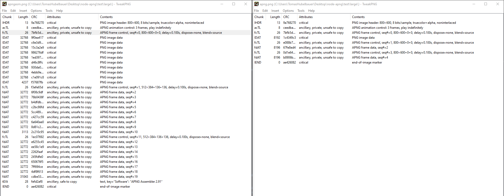

# Node APNG

A Node library for stitching `Buffer`s containing PNG image data together to
form an APNG image.

This repository contains an example animated image. It is uploaded with both
the APNG and the PNG extension. GitHub will display image preview only for
the variant with the PNG extension when accessing the file directly.

When embedded in MarkDown, such as in this readme, both extensions work as
image sources. Here's the APNG variant as an image source:

## To-Do

### Fix the issue with incomplete frames

According to TweakPNG, the library only writes the first 8kB of each frame, but
with frames which are larger than that, it will cause them to get cropped. The
fix should be to write multiple data chunks as needed - to mimic what APNGAsm
does.

